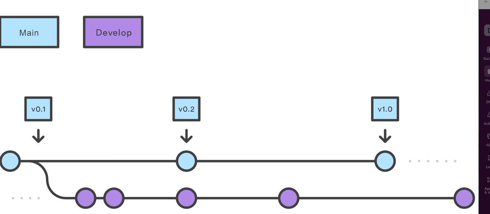

# Workflows

## Gitflow workflow



The idea is starting with 2 branches:

- main(master) : production ready state
- develop : latest delivered development state

### Supporting branches

#### Feature branches

- May branch off from: develop
- Must merge back into: develop
- Branch naming convention: feature/

**creating a feature branch**

```sh
git checkout -b feature/fr-001-authentication
```

**create pr**

```sh
gh pr create --base develop  --title "feat(api): #123 secure access for application" --body "
## Issues
    - feat(api) #123 secure access for application
## Impacted packages
    - api
" --assignee "@me,@copilot"
```

**finishing a feature branch**

```sh
git checkout develop
git pull origin develop
git merge --no-ff feature/fr-001-authentication
```

#### Release branches

Once develop has acquired enough features for a release, fork a release branch off of develop.
From now on, no new features can be added after this point—only bug fixes, documentation generation, and other release-oriented tasks should go in this branch.

Once it's ready to ship, the release branch gets merged into main and tagged with a version number.

```sh
git checkout develop
git pull origin develop
git checkout -b release/v1.0.0
git push origin release/v1.0.0
```

#### Hotfix branches

Maintenance or “hotfix” branches are used to quickly patch production releases. Hotfix branches are a lot like release branches and feature branches except they're based on main instead of develop. This is the only branch that should fork directly off of main. As soon as the fix is complete, it should be merged into both main and develop (or the current release branch), and main should be tagged with an updated version number.

```sh
git checkout main
git pull origin main
git checkout -b hotfix/type-id-title
git push origin hotfix/type-id-title

git checkout main
git merge hotfix/type-id-title
git push origin main

git checkout develop
git merge hotfix/type-id-title
git push origin develop

```

### Naming conventions

- `main`: production releases
- `develop`: integration branch for the next release
- `feature/` or `feat/`: new features
- `release/`: release preparation and stabilization
- `support/`: long-term maintenance of older released versions
- `bugfix/` or `fix/`: non-urgent bug fixes
- `hotfix/`: critical production patches that bypass the normal release flow
- `chore/`: maintenance tasks such as dependency or documentation updates
- `refactor/`: code improvements that neither fix bugs nor add features

## References

- https://www.atlassian.com/git/tutorials/comparing-workflows/gitflow-workflow
- https://www.atlassian.com/git/tutorials/comparing-workflows
- https://nvie.com/posts/a-successful-git-branching-model/
